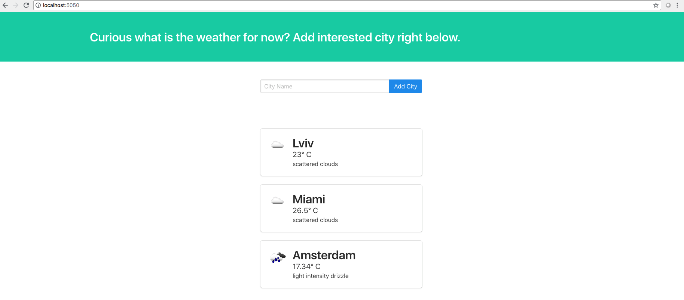

# Weather parser application
A simple application written using flask framework that shows weather of a particular city.

## Run a weather parser application
Execute next command in your shell
```bash
~ python weather.py 
```

## Demo
### Get weather for particular cities


### Add a city


## Contributing

### Setup
- clone the repository
- configure Git for the first time after cloning with your name and email
  ```bash
  git config --local user.name "Volodymyr Yahello"
  git config --local user.email "vjagello93@gmail.com"
  ```
- `python3.6` is required to run the code
- run `pip install -r requirements.txt` to install all require python packages

## Run auto tests
- Run `pytest -v` from shell in the root directory of the repository.